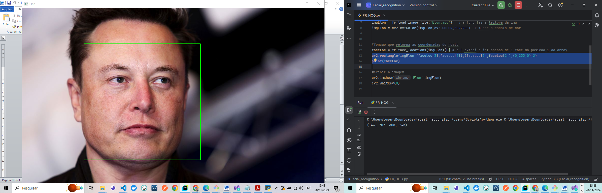
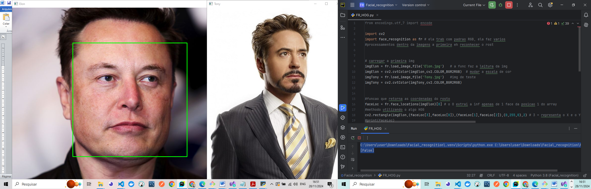
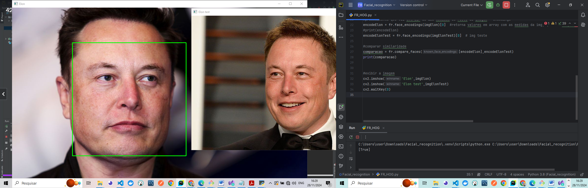
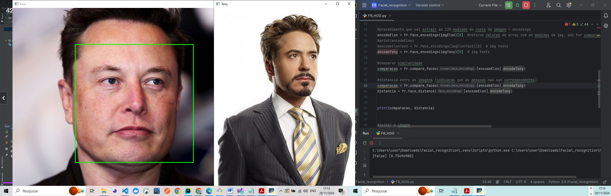

### 🧑‍💻 Face Recognition System with Webcam

 - This project combines face recognition techniques using the face_recognition library and OpenCV to implement a real-time face recognition system. The system is designed to detect faces in images and video feeds, encode their unique facial features, and compare them for recognition, creating an efficient face identification system.

---

<h4 align="center">Face Detection - img_FR_HOG 🚀</h4>

    <table>
        <tr>
            <td style="width: 50%; text-align: center;">
                
                
img_FR_HOG - rectangle_imgElon 

            </td>
            <td style="width: 50%; text-align: center;">
                
                
img_FR_HOG - compare_faces_false 

            </td>
        </tr>
    </table>

   
   
---

---

<h4 align="center">Face Detection - img_FR_HOG 🚀</h4>

    <table>
        <tr>
            <td style="width: 50%; text-align: center;">
                
                
img_FR_HOG - compare_faces_true 

            </td>
            <td style="width: 50%; text-align: center;">
                
                
img_FR_HOG - face_distance_0.73_false

            </td>
        </tr>
    </table>

   
   
---

#### 🚀 Features

 - Real-Time Face Detection: Captures live video feed from the webcam to detect faces in real-time.

  - Facial Encoding: Encodes faces from images stored in the Pessoas (People) folder into a unique numeric representation for easy comparison.

 - Face Comparison: Compares faces detected through the webcam against pre-encoded faces in the database to check for similarities.

 - Visual Overlay: Displays a rectangle around detected faces and shows the name of the recognized individual on the video feed.

 - Simple & Effective: Easy-to-use Python script for real-time face recognition, suitable for learning and practical applications.

#### 🛠️ Technologies Used

 - This project uses the following libraries:

 - OpenCV: For capturing the live webcam feed and drawing shapes (e.g., rectangles) on the images or video.

 - face_recognition: A library that simplifies facial recognition tasks like face detection, encoding, and comparison.

 - os: To manage file paths and interact with the directory structure containing images.

#### 🖥️ Installation Guide

Clone the repository:

bash
Copiar código
git clone https://github.com/your-repository/face-recognition-realtime.git
cd face-recognition-realtime
Install the required dependencies:

Make sure you have Python 3.7+ installed, then run the following command to install the necessary libraries:

bash
Copiar código
pip install opencv-python face-recognition
Prepare the Pessoas directory:

Create a folder named Pessoas in the project root directory.
Add images of people to the folder. The filenames should be the name of the person (e.g., John.jpg, Elon.jpg).
📂 Directory Structure
bash
Copiar código
face-recognition-realtime/
├── main.py               # Main Python file for the project
├── Pessoas/              # Folder containing images for encoding
│   ├── John.jpg
│   ├── Elon.jpg
│   └── ...
└── README.md             # Project documentation
▶️ How to Run
Run the script:

bash
Copiar código
python main.py
Allow access to your webcam. The script will:

Resize the live video feed for performance optimization.
Detect faces in real-time.
Compare webcam faces with pre-encoded faces from the Pessoas folder.
Display the name of the recognized person and draw a bounding box around their face.
Press q to exit the program.
📝 Code Overview
1. Encoder Creation (criarEncoders)
This function iterates through all images in the Pessoas folder.
It converts each image to RGB format, as required by the face_recognition library.
The function generates an encoding for each face and stores it alongside the corresponding name.
2. Webcam Face Comparison (compararWebcam)
Captures the live video feed from the webcam using OpenCV.
Detects faces in each frame, resizing the video for performance.
Compares the live face encodings with pre-encoded faces from the Pessoas folder.
Displays the name and draws a bounding box around the face on the live feed.
🔧 Customization
Tolerance Adjustment:
Adjust the tolerance parameter in the fr.compare_faces function to fine-tune face matching sensitivity.

Add More Images:
Add more images to the Pessoas folder to increase the recognition database.

Performance Optimization:
Modify the frame resizing parameters for a balance between speed and accuracy in face detection.

🛡️ Limitations and Recommendations
Lighting Conditions:
The recognition performance may vary under poor lighting or when faces are at extreme angles.

Dataset Size:
Larger datasets require more processing power and may affect performance.

Face Detection Limitations:
Faces should be clear and front-facing for optimal recognition accuracy.

🤝 Contributions
Contributions are welcome! To contribute to the project:

Fork the repository.

Create a new branch:

bash
Copiar código
git checkout -b feature/your-feature-name
Commit your changes:

bash
Copiar código
git commit -m "Add your feature description"
Push your branch:

bash
Copiar código
git push origin feature/your-feature-name
Open a pull request.

📜 License
This project is open-source and available under the MIT License.

🙌 Acknowledgements
Face Recognition library by Adam Geitgey for simplifying facial recognition tasks.
OpenCV for enabling real-time video processing and easy integration with Python.

### 📦 Contribution

 - Feel free to contribute by submitting pull requests or reporting issues.

- #### My LinkedIn - 

## 🌐 **Contact**

#### [**Luciana Diemert**](https://github.com/ludiemert)

🛠 Full-Stack Developer  
🖥️ Python Enthusiast | Computer Vision | AI Integrations  
📍 São Jose dos Campos – SP, Brazil

&nbsp;
&nbsp;
&nbsp;
&nbsp;

 

---
Developed with ❤ by [ludiemert](https://github.com/ludiemert).
