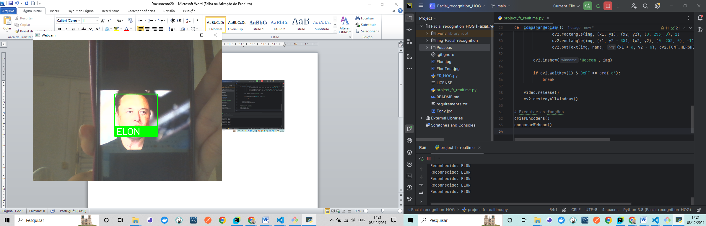

## 💻🚀 Real-Time Face Recognition with Webcam

 - This project implements a **real-time face recognition system** using Python and OpenCV.
 - By leveraging the `face_recognition` library, the application detects faces through a webcam feed and compares them with pre-encoded images stored in a directory.

---

<h4 align="center">Face Detection - img_project_fr_realtime 🚀</h4>

<div align="center">
    <table>
        <tr>
            <td style="width: 50%; text-align: center;">
                
                <p style="margin-top: 5px;"> img_project_fr_realtime - 01_list_encoders </p>
            </td>
            <td style="width: 50%; text-align: center;">
                
                <p style="margin-top: 5px;"> img_project_fr_realtime - img_FR_HOG - 1_test_finsh_project_fr_realtime </p>
            </td>
        </tr>
    </table>
</div>

  <br/>
  <br/>

<h4 align="center">Face Detection - img_project_fr_realtime 🚀</h4>

<div align="center">
    <table>
        <tr>
            <td style="width: 50%; text-align: center;">
                
                <p style="margin-top: 5px;">img_project_fr_realtime - 2_nome_sem_extensao </p>
            </td>
            <td style="width: 50%; text-align: center;">
                
                <p style="margin-top: 5px;">img_project_fr_realtime - 2_test_finsh_project_fr_realtime</p>
            </td>
        </tr>
    </table>
</div>

  <br/>
  <br/>

  ---- 

## 🚀 Features

- **Real-Time Face Detection:** Captures live webcam feed to identify faces in real-time.
- **Face Encoding:** Generates unique encodings for images stored in the `Pessoas` (People) folder.
- **Face Comparison:** Matches webcam faces against the pre-encoded database with high accuracy.
- **Dynamic Overlay:** Displays a rectangle and the name of the recognized person directly on the video feed.
- **Ease of Use:** Simple and intuitive Python implementation for learning and development purposes.

---

## 🛠️ Technologies Used

This project uses the following Python libraries:

- **[OpenCV](https://opencv.org/):** For video capture and drawing shapes (e.g., rectangles) on the video feed.
- **[face_recognition](https://github.com/ageitgey/face_recognition):** Provides tools for face detection, encoding, and comparison.
- **[os](https://docs.python.org/3/library/os.html):** Facilitates file and directory operations for accessing image files.

---

## 🖥️ Installation Guide

1. **Clone the repository:**
   ```bash
   git clone https://github.com/your-repository/face-recognition-realtime.git
   cd face-recognition-realtime
   ```
   
Install required dependencies: Make sure you have Python 3.7+ installed. Then, run:
  ```bash
 pip install opencv-python face-recognition
  ```


 - Prepare the Pessoas directory:

 - Create a folder named Pessoas in the project root.
 - Add images of people to the folder. The filenames should be the person's name (e.g., John.jpg).

#### 📂 Directory Structure

 ```bash
face-recognition-realtime/
│
├── main.py               # Main Python file for the project
├── Pessoas/              # Folder containing images for encoding
│   ├── John.jpg
│   ├── Elon.jpg
│   └── ...
└── README.md             # Project documentation
 ```

#### ▶️ How to Run
Run the script:

 ```bash
python main.py
 ```

- Allow the script to access your webcam. It will:

 - Resize the live video feed for performance optimization.
 - Detect faces in real-time and compare them with pre-encoded faces.
 - Display the recognized person's name and bounding box on the screen.
 - Press q to exit the program.

#### 📝 Code Overview

1. Encoder Creation (criarEncoders)
Iterates through all images in the Pessoas directory.
Converts images to RGB format (as required by face_recognition).
Generates encodings for each face and stores them alongside the corresponding name.

2. Webcam Face Comparison (compararWebcam)
Captures real-time video feed using OpenCV.
Detects faces in each frame, resizing for performance.
Compares live face encodings to pre-existing encodings.
Displays the matching name and bounding box on the video feed.

#### 🔧 Customization
 - Tolerance Adjustment: Modify the tolerance parameter in the fr.compare_faces function to make face matching stricter or more lenient.
 - Add More Images: Include more images in the Pessoas directory for larger datasets.
 - Adjust Performance: Optimize frame resizing for better balance between speed and accuracy.

#### 🛡️ Limitations and Recommendations
 - Lighting Conditions: Performance may vary in poor lighting or extreme angles.
 - Dataset Size: Larger datasets may require more processing power.
 - Face Detection Limitations: Ensure that faces in images are clear and front-facing for optimal results.

#### 🤝 Contributing

 ```bash
Fork the repository.
Create a new branch:

git checkout -b feature/your-feature-name
Commit your changes:

git commit -m "Add your feature description"
Push to the branch:


git push origin feature/your-feature-name
Open a pull request.

 ```

##### 📜 License
 - This project is open-source and available under the MIT License.

##### 🙌 Acknowledgements
 - Inspired by the Face Recognition library by Adam Geitgey.
 - Thanks to OpenCV for enabling real-time video processing.


### 📦 Contribution

 - Feel free to contribute by submitting pull requests or reporting issues.

- #### My LinkedIn - [](https://www.linkedin.com/in/lucianadiemert/)

## 🌐 **Contact**


#### [**Luciana Diemert**](https://github.com/ludiemert)

🛠 Full-Stack Developer <br>
🖥️ Python Enthusiast | Computer Vision | AI Integrations <br>
📍 São Jose dos Campos – SP, Brazil

<a href="https://www.linkedin.com/in/lucianadiemert" target="_blank"></a>&nbsp;
<a href="mailto:lucianadiemert@gmail.com" target="_blank"></a>&nbsp;
<a href="#"></a>&nbsp;
<a href="https://www.github.com/ludiemert" target="_blank"></a>&nbsp;

<br clear="left"/>

---
Developed with ❤ by [ludiemert](https://github.com/ludiemert).
